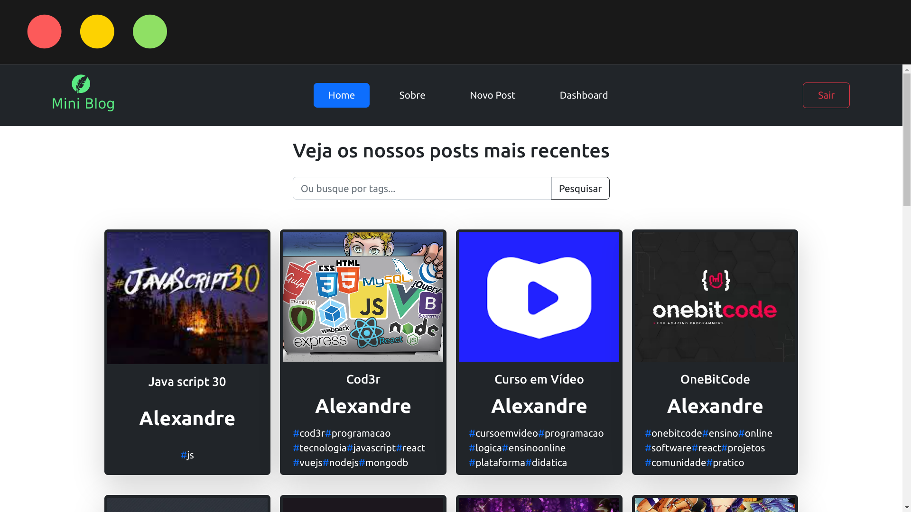

# Projeto MiniBlog



## 💭 Descrição

Esse projeto é um Mini Blog que permite aos usuários se cadastrar, criar postagens, realizar buscas por tags, além de fornecer uma dashboard para edição e exclusão de postagens. O projeto utiliza o Firebase como backend para o armazenamento de dados e autenticação de usuários.

## 🧠 Funcionalidades

✔️ **Registro de Usuários** - Os usuários podem criar contas para criar suas próprias postagens.

✔️ **Criação de Postagens** - Os usuários podem criar postagens com títulos, url da imagem, conteúdo e tags para categorização.

✔️ **Busca por Tags** - A funcionalidade de busca permite aos usuários encontrar postagens com base em tags específicas.

✔️ **Dashboard de Usuário** - Os usuários têm acesso a uma dashboard para gerenciar suas postagens, incluindo edição e exclusão.

✔️ **Sistema de Autenticação** - O projeto utiliza a autenticação fornecida pelo Firebase.

✔️ **Sistema de Dados** - O projeto utiliza a firestore database fornecida pelo Firebase.

## 🖥️ Tecnologias Utilizadas

- [React](https://react.dev) - biblioteca para interfaces de usuário.
- [React Router Dom](https://reactrouter.com/en/main) - é uma biblioteca de roteamento que permite criar rotas e navegação de página.
- [Javascript](https://developer.mozilla.org/pt-BR/docs/Web/JavaScript) - é uma linguagem de programação.
- [Firebase](https://firebase.google.com/?hl=pt) - plataforma da Google para criar aplicativos com recursos de autenticação, banco de dados, etc.
- [Bootstrap](https://getbootstrap.com) - framework CSS.

## 🛠️ Modificando o projeto

### Siga as seguintes instruções para instalar e poder modificar o projeto em sua máquina:

### 📋 Pré-requisitos:

Para baixar, executar e modificar o projeto, você precisa ter instalado em sua máquina:

- [Node](https://nodejs.org/en)
- Um gerenciador de pacotes, como o [PNPM](https://pnpm.io), [Npm](https://nodejs.org/en/) ou [Yarn](https://classic.yarnpkg.com/lang/en/docs/install)
- [Git](https://git-scm.com/downloads)
- Editor de código ou IDE, como o [VSCode](https://code.visualstudio.com/Download)

### 🔧 Instalação e execução

1. Clone o repositório

```bash
git clone https://github.com/aleretamero/miniblog.git
```

2. Acesse a pasta do projeto

```bash
cd miniblog
```

3. Instale as dependências

```bash
npm install
# ou
pnpm install
# ou
yarn install
```

4. Inicie o servidor de desenvolvimento do projeto

```bash
npm start
# ou
pnpm start
# ou
yarn start
```

Obs: o servidor iniciará na porta 3000 - acesse por: <http://localhost:3000/>

## Colaboradores 🤝🤝

| Foto                                                       | Nome                                                 |
| ---------------------------------------------------------- | ---------------------------------------------------- |
|  | [Alexandre Retamero](https://github.com/aleretamero) |

## Licença

[MIT](https://choosealicense.com/licenses/mit/)

